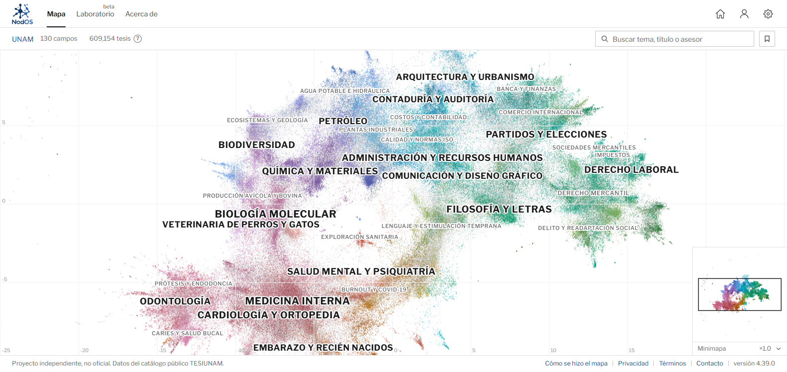
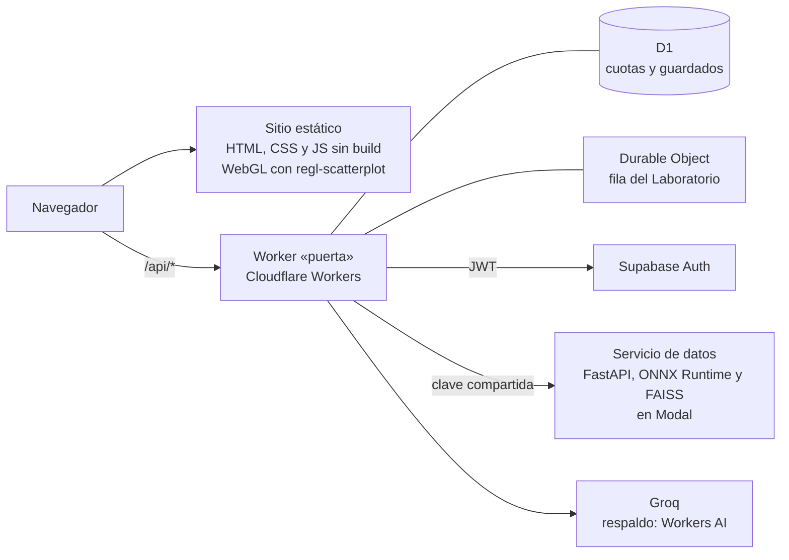

# NodOS

**Mapa semántico de las tesis de la UNAM.** [nodosmap.com](https://nodosmap.com)

NodOS ordena más de 600 mil tesis de licenciatura, maestría y doctorado del catálogo TESIUNAM
según el parecido de sus títulos. Las que tratan temas cercanos quedan juntas, sin importar la
facultad o el programa, y el mapa se recorre en tres niveles: 130 campos, unos 430 temas y 513
subtemas.



El sitio tiene tres partes:

- **Mapa.** Búsqueda por tema, título o asesor, la ficha de cada tesis con sus vecinas más
  cercanas y las tesis que ha dirigido cada asesor.
- **Laboratorio.** Quien prepara una tesis describe su proyecto y recibe su ubicación en el mapa,
  las tesis más parecidas, los asesores con experiencia en el tema y una lectura del planteamiento
  redactada por un modelo de lenguaje.
- **Mi espacio.** Tesis, asesores, lugares del mapa y análisis guardados, con cuenta.

NodOS es un proyecto independiente. No es un sitio oficial de la Universidad Nacional Autónoma de
México.

## Método

1. **Datos.** Registros bibliográficos del catálogo público TESIUNAM, depurados y normalizados.
   Del título se retira la mención del autor, y ningún archivo publicado contiene nombres de
   autor. Los de asesor sí se publican.
2. **Representación.** Cada título se convierte en un vector de 1024 dimensiones con
   `multilingual-e5-large`. Solo se usa el título: el programa y el área no se mezclan en el
   texto, para que el mapa muestre parentescos entre disciplinas.
3. **Grupos.** UMAP reduce los vectores a 5 dimensiones y HDBSCAN encuentra 513 subtemas por
   densidad. Un agrupamiento jerárquico de Ward sobre sus centroides forma los temas y los campos,
   con cortes por distancia y correcciones revisadas a mano.
4. **Mapa.** PaCMAP proyecta los vectores a dos dimensiones. Las palabras clave de cada grupo se
   calculan con c-TF-IDF, y los nombres de los campos se redactaron a mano.
5. **Vecinas.** Para cada tesis se precalculan las más parecidas con FAISS. El Laboratorio hace
   la misma búsqueda en vivo con el mismo modelo, exportado a ONNX.

El detalle, con los comandos de cada paso, está en [`pipeline/README.md`](pipeline/README.md).

## Arquitectura



- **Sitio** (`sitio/`). Páginas estáticas sin paso de compilación: cada página es un solo archivo
  HTML. Las bibliotecas van con versión fija en `sitio/vendor/`. El mapa carga sus datos por
  partes, a medida que se necesitan.
- **Worker «puerta»** (`services/puerta/`). La única API pública. Verifica la sesión (JWT de
  Supabase contra su JWKS), aplica los límites por IP y por usuario, Turnstile y las cuotas diarias,
  administra la fila de análisis y guarda los datos de cada cuenta. Limpia la entrada contra la
  inyección de instrucciones antes de cada llamada al modelo de lenguaje y valida cada respuesta
  contra un esquema.
- **Servicio de datos** (`services/lab/`). Embebe la consulta, busca las 100 tesis más parecidas
  entre todo el corpus y calcula el contexto del análisis: ubicación, saturación y asesores. No ve
  cuentas ni guarda nada.

## Estructura del repositorio

```
sitio/            las páginas, sus estilos y scripts, y las bibliotecas (sitio/data/ se descarga)
services/puerta/  Worker de la API: código, migraciones de D1 y pruebas
services/lab/     servicio de datos del Laboratorio (FastAPI, Docker y Modal)
pipeline/         del dataset público a los archivos del mapa
tools/            descarga de datos, armado del sitio y pruebas en Chrome headless
```

## Correr en local

Requisitos: Python 3.12 y, para las pruebas, Node.js 22 y Google Chrome.

```sh
git clone https://github.com/ssebastian-diazz/nodos-map.git
cd nodos-map
python tools/descargar_datos.py                      # datos del mapa: 110 MB comprimidos
python -m http.server 8765 --directory sitio         # abrir http://127.0.0.1:8765/
```

El mapa funciona completo así. El Laboratorio muestra sus análisis de ejemplo; para hacer análisis
nuevos en local se necesitan el Worker y el servicio de datos:

- [`services/puerta/README.md`](services/puerta/README.md): variables, secretos, migraciones de D1
  y cómo correr el Worker con `wrangler dev`.
- [`services/lab/README.md`](services/lab/README.md): construcción de los artefactos (modelo e
  índice) y cómo correr el servicio en local, con Docker o en Modal.

## Pruebas

El CI (`.github/workflows/pruebas.yml`) corre en cada push y cada pull request:

| Prueba | Qué verifica |
|---|---|
| Privacidad | Ningún título publicado conserva la mención de autor |
| Humo | Cada página carga en Chrome headless sin errores en la consola |
| Léxico y defensas | Casos límite del clasificador de objetivos (taxonomía de Bloom), casos de inyección de instrucciones y defensas del Worker |
| Worker | El Worker completo en `wrangler dev` contra un servicio simulado: sesión, acceso cruzado, cuotas, 50 análisis simultáneos y la fila |

En local:

```sh
CHROME="/ruta/a/chrome" node tools/prueba_humo.mjs   # con el sitio servido en el puerto 8765
node --test services/puerta/pruebas/bloom.test.mjs
cd services/puerta && npm ci && bash pruebas/ci.sh
```

## Despliegue

El sitio y el Worker se publican en Cloudflare, y el servicio de datos en Modal:

```sh
python tools/construir_sitio.py                            # arma dist/ y revisa los límites de tamaño
npx wrangler deploy -c tools/sitio.wrangler.jsonc          # sitio
cd services/puerta && npx wrangler deploy --env produccion # API
modal deploy services/lab/modal_app.py                     # servicio de datos
```

Antes de publicar una copia propia, cambia en `tools/sitio.wrangler.jsonc` y
`services/puerta/wrangler.jsonc` la cuenta (`account_id`), la base de datos (`database_id`), los
dominios y la URL del servicio de datos, y en `sitio/compartido/sesion.js` el proyecto de Supabase.
Los secretos se cargan con `wrangler secret put`; nunca van en el repositorio.

## Licencias

- **Código:** [MIT](LICENSE).
- **Datos:** el dataset depurado se publica en
  [Kaggle](https://www.kaggle.com/datasets/sebastiandiazprado/nodos-map) con licencia CC BY 4.0.
  Los registros de origen provienen del catálogo TESIUNAM de la UNAM, y las tesis pertenecen a sus
  autores. NodOS no aloja ni reproduce el texto de ninguna tesis.
- **Marca:** el nombre NodOS y su logotipo no están incluidos en estas licencias.

## Cómo citar

> Díaz Prado, S. (2026). *NodOS: mapa semántico de las tesis de la UNAM*. https://nodosmap.com

## Contacto

[contacto@nodosmap.com](mailto:contacto@nodosmap.com).
