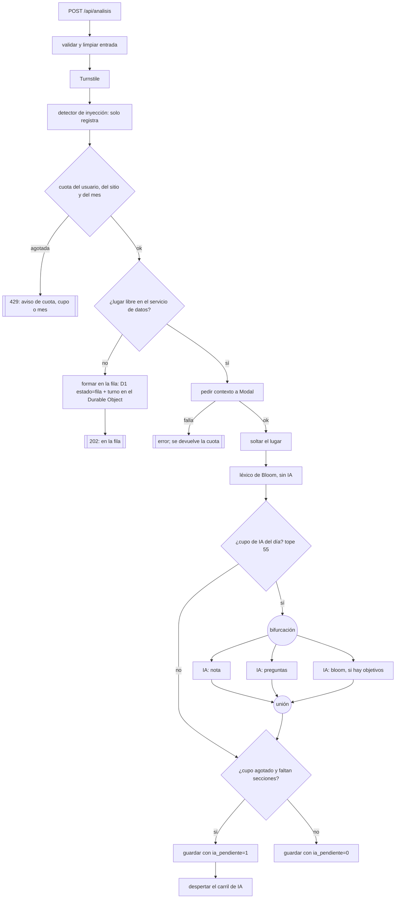
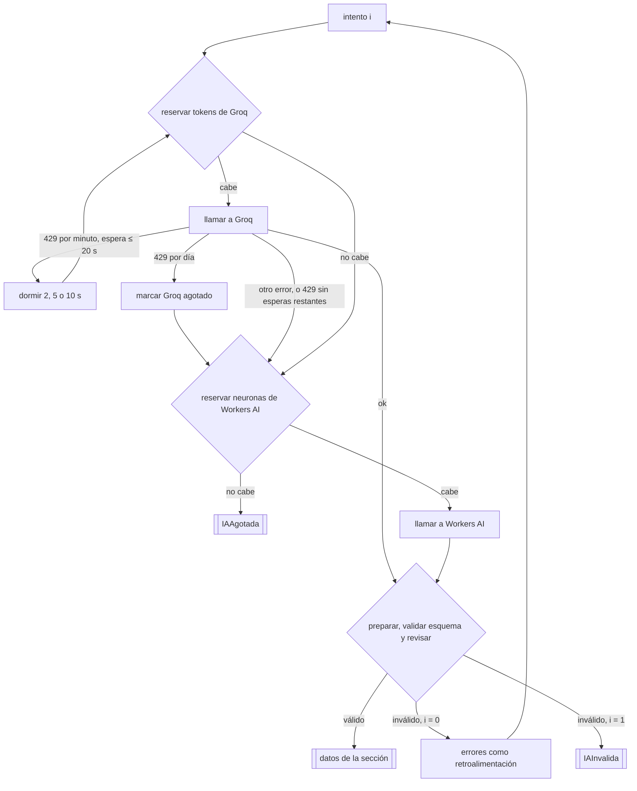
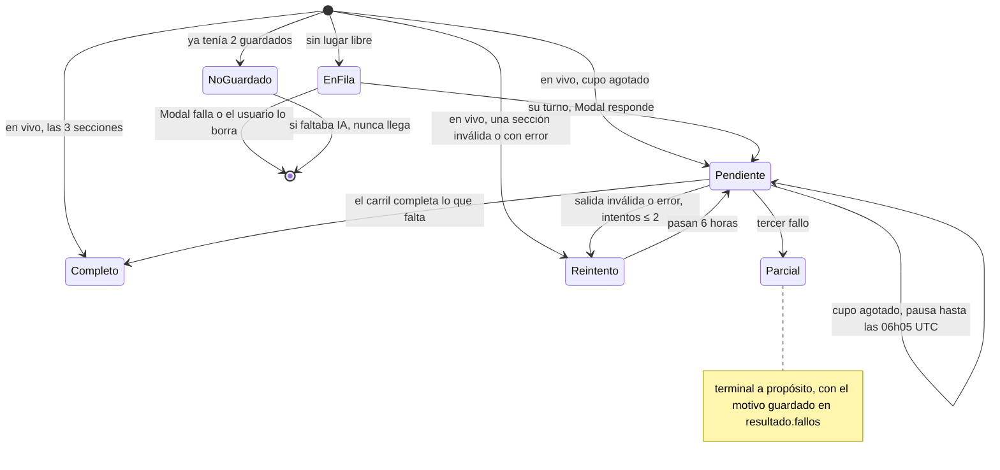

# El Laboratorio como grafo

Formalización del flujo de un análisis del Laboratorio, leída del código de `services/puerta/src/`
(versión 1.0.5, 2026-10-04). Tres niveles: el análisis completo, la llamada a la IA por dentro y el
ciclo de vida del registro en D1. Los diagramas son Mermaid: se ven en GitHub, o en VS Code con la
extensión «Markdown Preview Mermaid Support».

Notación: rectángulo = paso (nodo); rombo = decisión (arista condicional); círculo = bifurcación o
unión en paralelo; doble borde = salida (estado terminal).

## 1. Un análisis, de la petición a la respuesta (`analisis.js`)

Cada nodo que termina manda su evento por SSE (`lexico`, `datos`, `nota`, `preguntas`, `bloom`,
`ia_agotada`, `error`, `fin`): la página pinta cada sección en cuanto llega.

## 2. Una llamada a la IA por dentro (`ia/proveedores.js`, `pedirIA`)

Aquí están los ciclos: la espera ante el límite por minuto y el reintento con retroalimentación.

## 3. Ciclo de vida del análisis guardado (D1 + Durable Object `Fila`)

Hasta la 1.0.5, `Parcial` era un **sumidero** al que se llegaba con el primer fallo: solo la falta de
cupo dejaba pendiente un análisis (`r.agotada`). Al 4-oct-2026 había 15 parciales y 18 sin IA y sin
pendiente (de 342 desde el 1-oct). Desde la 1.0.6 (`planIA` en `analisis.js`), un fallo que no es por
cupo cuenta un intento, espera `IA_REINTENTO_HORAS` (6) y vuelve a la fila del carril; tras
`IA_REINTENTOS` (2) reintentos queda en `Parcial`, ya con el motivo guardado. En la base, `Reintento`
es `ia_pendiente = 1` con `ia_siguiente` en el futuro.

## Correspondencia con LangGraph

| LangGraph | NodOS |
|---|---|
| `StateGraph` y su estado | `entrada`, `lexico`, `datos`, `ia`, `costos` (variables de `analisisSSE`/`correrIA`) |
| nodo | cada función: `limpiarEntrada`, `pedirContexto`, `clasificarObjetivos`, `pedirIA`… |
| `add_conditional_edges` | los `if`: cuota, lugar, cupo de IA, proveedor, validez |
| `Send` (bifurcación en paralelo) | `Promise.all` de las 3 tareas (`analisis.js:99`) |
| ciclo con condición de salida | reintento con retroalimentación (`intento < 2`) y espera ante 429 |
| `checkpointer` (persistencia y reanudación) | D1 (`estado`, `ia_pendiente`) y el almacenamiento del Durable Object (cola, lugares, en curso, pausa) |
| `interrupt` (pausa para un humano) | no hay |
| nodo agente (el LLM elige la arista) | no hay: todas las aristas las decide el código |
